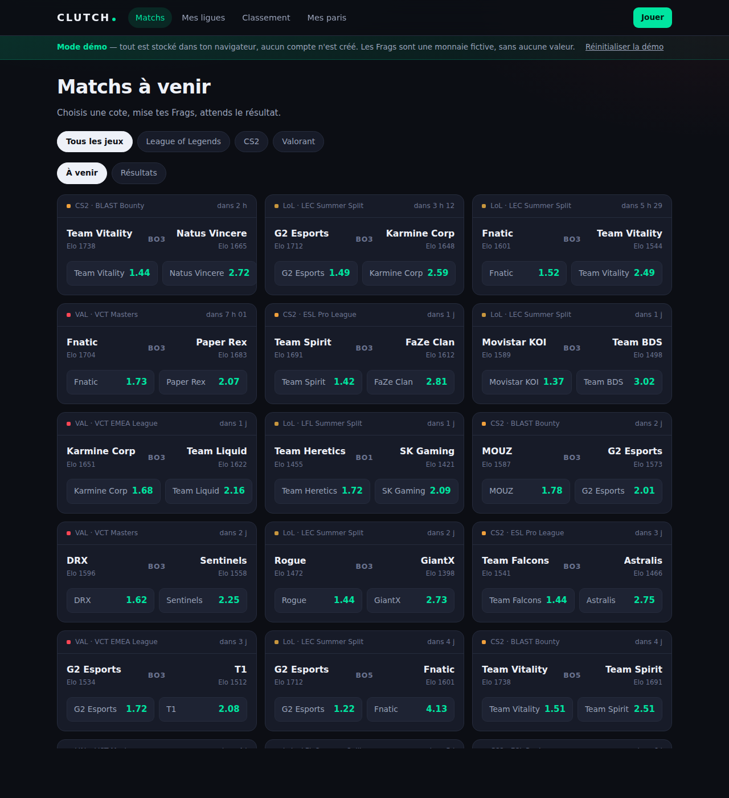
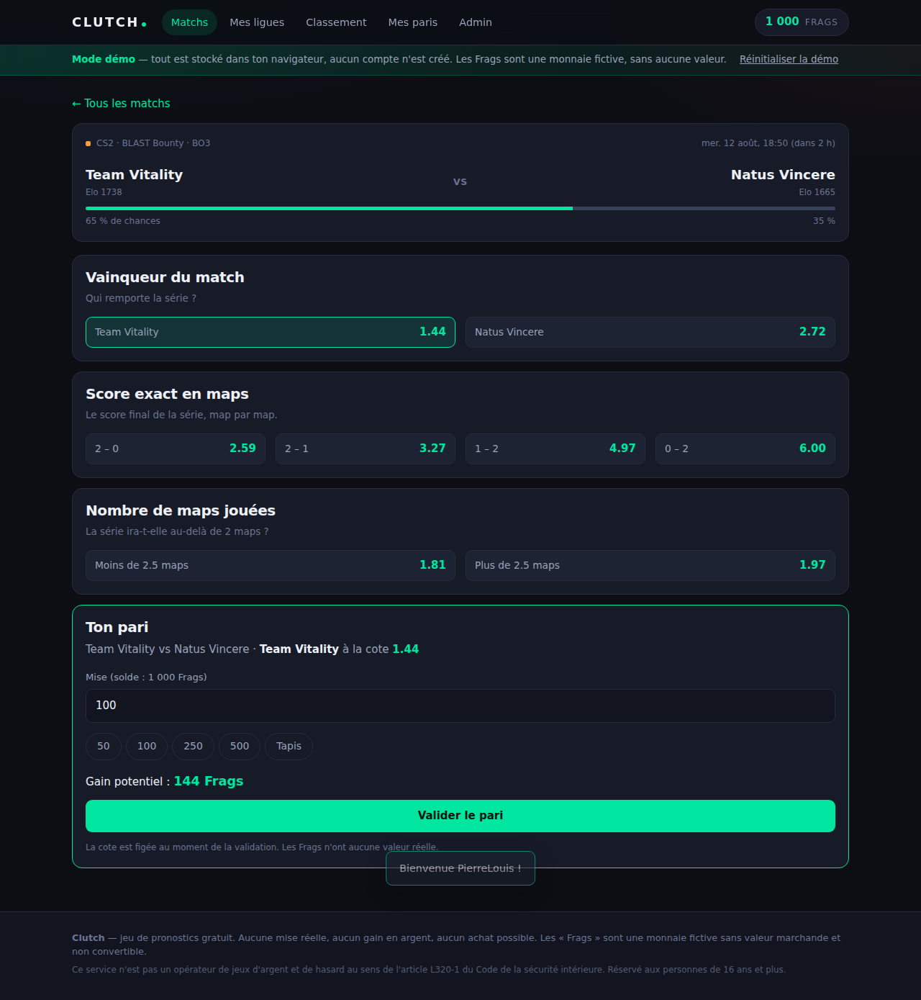
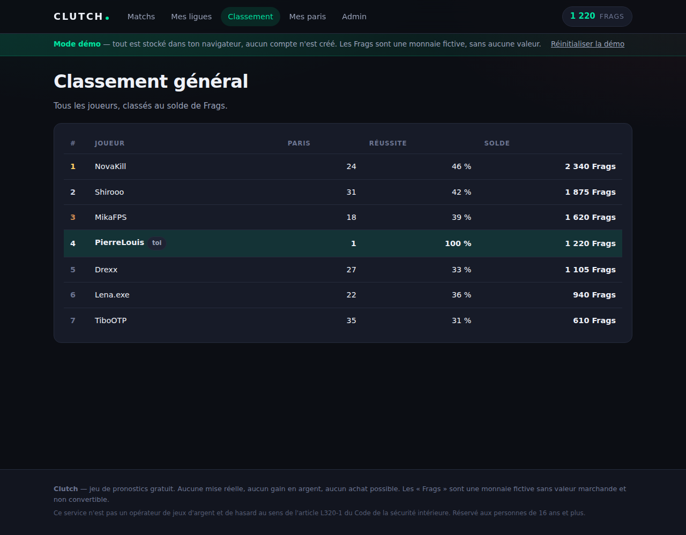
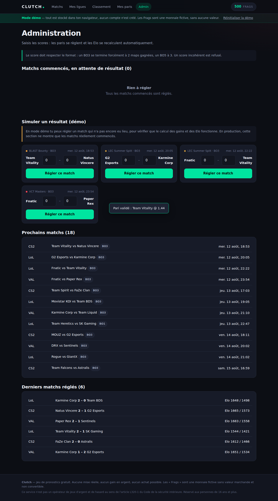

<div align="center">

# CLUTCH

**Le prono esport entre potes.** Pronostique les matchs LoL, CS2 et Valorant,
mise des Frags — une monnaie fictive — et grimpe dans le classement de ta ligue.

Application web · Extension Chrome · Zéro dépendance · Zéro build

</div>

---

## Ce que c'est

Un jeu de pronostics esport gratuit. On choisit un match, on mise des **Frags**
à la cote proposée, et on gagne des points si on a vu juste. Le classement se
joue dans des ligues privées créées entre amis.

**Ce n'est pas un site de paris.** Aucun argent réel n'entre ni ne sort :
les Frags ne s'achètent pas, ne se convertissent pas, et ne valent rien.
Voir [la section juridique](#cadre-juridique).

## Ce qui est dedans

| Fonctionnalité | État |
|---|---|
| Calendrier multi-jeux (LoL, CS2, Valorant) | ✅ |
| Cotes calculées par un modèle Elo maison | ✅ |
| Trois marchés : vainqueur, score exact, nombre de maps | ✅ |
| Mise avec cote figée à la validation | ✅ |
| Saisons : soldes remis à zéro à chaque nouvelle période | ✅ |
| Ligues privées avec code d'invitation | ✅ |
| Palmarès des saisons passées | ✅ |
| Classement de ligue et classement général | ✅ |
| Prime quotidienne et filet anti-faillite | ✅ |
| Console d'administration pour saisir les résultats | ✅ |
| Extension Chrome : overlay sur Twitch et YouTube | ✅ |
| Mode démo complet, sans serveur | ✅ |
| Récupération automatique des résultats via API | ⏳ v2 |
| Notifications push | ⏳ v2 |

## Aperçu

| Le calendrier | Le bulletin de pari |
|---|---|
|  |  |

| Le classement | La console d'administration |
|---|---|
|  |  |

## Démarrer en 30 secondes

Aucune installation, aucun compte :

```bash
cd web
python3 -m http.server 8123
```

Puis ouvre <http://localhost:8123>. L'application démarre en **mode démo** :
calendrier pré-rempli, adversaires fictifs, progression stockée dans ton
navigateur. Tu peux miser, créer une ligue et régler des matchs depuis la page
Admin pour voir le moteur tourner.

Pour passer en production (vrais comptes, vraie base de données),
suis [DEPLOIEMENT.md](DEPLOIEMENT.md) — environ 30 minutes, sans écrire une
ligne de code.

## Comment sont calculées les cotes

Chaque équipe porte un **Elo** par jeu. La probabilité que l'équipe A gagne une
map se déduit de l'écart d'Elo :

```
p = 1 / (1 + 10^((eloB - eloA) / 400))
```

Cette probabilité de map est ensuite agrégée en probabilité de série selon le
format (BO1, BO3, BO5), ce qui donne d'un coup **toute la distribution des
scores possibles** — et donc les trois marchés. La cote servie est :

```
cote = 1 / (p × (1 + marge))
```

avec une marge de 6 %. C'est elle qui rend le jeu perdant à long terme si on
mise au hasard, exactement comme chez un vrai opérateur : sans elle, le
classement finirait dominé par celui qui mise le plus, pas par celui qui voit
le mieux.

Après chaque match, les Elo sont mis à jour, pondérés par l'écart de maps :
gagner 2-0 déplace plus le classement que gagner 2-1.

Tout est dans [`web/js/core.js`](web/js/core.js), commenté, et couvert par les
tests.

## Les saisons, et pourquoi elles existent

Le solde d'un joueur n'est pas global : il appartient à une **saison**. À
l'ouverture d'une nouvelle saison, tout le monde repart au même niveau.

C'est le point de conception le plus important du jeu. Sans saisons, un pote qui
rejoint trois semaines après les autres a un écart mathématiquement
irrattrapable — il joue une partie qu'il ne peut pas gagner, et il décroche. Avec
elles, chaque grand tournoi est un nouveau départ, et le palmarès garde la trace
des vainqueurs précédents.

Les ligues, elles, **survivent aux saisons** : « Les potes du Discord » reste la
même ligue d'une saison à l'autre, seul son classement est remis à plat. Le statut
d'une saison (à venir, en cours, terminée) se déduit des dates, il n'y a rien à
maintenir à la main. Une saison qui n'est pas en cours est consultable mais
verrouillée : ni mise, ni prime de connexion.

## Ce qui se joue en plus des matchs

Quatre mécaniques se greffent sur les paris, sans toucher au moteur de cotes.

**La prime de connexion, en série de sept jours.** Le montant grimpe de 120 à
420 Frags tant que la série tient, et retombe au premier jour manqué. Deux
garde-fous : au-dessus de 3 000 Frags de solde la prime revient au plancher, et
à partir du troisième jour la bonification demande d'avoir misé dans la
semaine. Se connecter ne doit jamais être une stratégie de classement.

**L'équipe préférée.** Choisie à l'inscription, modifiable depuis le profil.
Elle met les matchs concernés en avant dans le calendrier, ajoute un filtre
dédié et affiche les couleurs du joueur au classement. Elle ne touche à aucune
cote — personne ne fait de cadeau à son équipe.

**Le call de la saison.** Un seul pronostic par saison : qui gagne tel tournoi.
Il se pose avant le premier match du tournoi visé, la mise est bloquée jusqu'au
sacre, et la cote se déduit des Elo des équipes engagées avec la même marge que
sur un match. Il reste affiché sur le profil jusqu'à la finale. C'est ce qui
garde en vie un joueur mal parti — et la phrase qu'il ressortira en avril.

**La rivalité de la semaine.** Un duel avec un joueur proche au classement,
tiré de façon déterministe à partir de la semaine ISO : il ne bouge pas d'une
page à l'autre et change tout seul le lundi. Aucune table, aucune donnée
nouvelle — c'est du classement existant relu autrement.

**Le prono par défaut.** Si le joueur n'a rien saisi à l'heure du coup d'envoi,
Clutch mise pour lui sur le favori. Ce n'est pas une stratégie — le favori perd
lentement à cause de la marge — c'est un filet : rater une soirée ne doit pas
sortir quelqu'un du classement. Réglable par joueur (jamais / mes matchs /
tous), avec une mise plafonnée, et posé à deux moments : à l'ouverture de
l'application pour les matchs commencés, et au règlement pour ceux qui n'ont
pas ouvert l'application du tout.

**Le défi de ligue.** Un tournoi tiré au sort par ligue et par saison, avec un
classement parallèle où seuls les paris posés sur ce tournoi comptent, au
bénéfice net. Volontairement à côté du classement principal : deux classements
concurrents dilueraient l'enjeu, un classement et un défi donnent une seconde
chance.

**Le classement à trois entrées.** Le solde, remis à zéro chaque saison, dit
qui mène *maintenant*. Le retour sur mise, à partir de dix paris réglés, dit
qui parie le mieux indépendamment du volume. La note à vie, elle, traverse les
saisons : c'est un Elo joué contre le marché — avoir raison quand la cote te
donnait tort la fait monter, se tromper sur un favori la fait chuter. La mise
n'entre pas dans son calcul, volontairement : elle mesure la justesse du
jugement, pas le courage. Le solde s'occupe déjà de ça.

**Les badges.** Vingt et une récompenses, en six familles. Aucune ne récompense
le volume : poser cent paris ne prouve rien, et un badge « 100 paris » pousserait
exactement au comportement qu'on ne veut pas. Ils se calculent à la volée depuis
les paris réglés — aucune table, rien à migrer, impossible à désynchroniser — et
les règles vivent dans `core.js` uniquement, jamais dupliquées en SQL.

**Les cartes « je l'avais dit ».** Un pari gagné à 2,50 ou plus, ou qui rapporte
1 000 Frags, devient une image partageable au format 1200 × 630 — celui des
aperçus Discord et Twitter. Dessinée en SVG puis rastérisée dans un canvas :
aucune dépendance, aucun service d'image à héberger.

**Le profil d'analyste.** Rentabilité par format, par jeu, par marché, par
niveau de cote, et comparaison entre les matchs de son équipe préférée et tous
les autres. Le résultat n'est pas un tableau de plus mais des constats rédigés
— et jamais sur un groupe de moins de cinq paris, parce qu'en dessous un écart
de rentabilité raconte le hasard, pas le jugement du joueur.

## Créer une compétition

La console d'administration ne se contente plus de saisir des scores : elle crée
les **tournois**, les **équipes** et les **matchs**. C'était le dernier obstacle
entre le produit et une vraie partie — jusque-là, tout tournait sur un calendrier
de démonstration, et jouer un vrai tournoi supposait d'écrire des `insert` à la
main.

Deux garde-fous : un match ne peut pas être créé dans le passé (il serait fermé
aux mises d'emblée, sans que personne comprenne pourquoi), et les deux équipes
doivent jouer au même jeu que le tournoi.

Elle apporte aussi l'**annulation avec remboursement**, identifiée comme risque
dans le cadrage initial (« matchs reportés, forfaits ») et restée sans réponse
jusqu'ici. Un match annulé rend toutes les mises à l'unité près, et ne touche ni
aux notes ni aux Elo : un match qui n'a pas eu lieu n'apprend rien sur personne.

## L'interface

**Une seule colonne, étroite.** 720 px, quel que soit l'écran. C'est le choix qui
change le plus : une application se lit en descendant, un tableau de bord
s'éparpille. Les cartes de match passent pleine largeur et deviennent lisibles.

**Quatre onglets, en bas.** Matchs · Ligues · Classement · Moi, plus Admin quand
on l'est. Sur grand écran, la barre devient un dock flottant centré. Le call a
quitté le menu : il ne se pose qu'avant le début d'un tournoi, donc il s'affiche
en haut du calendrier tant qu'il est posable, et nulle part le reste du temps.

**Des blocs à bandeau.** Chaque section porte un titre en petites capitales
espacées sur une bande colorée. Quand toutes les cartes ont la même surface, le
même rayon et le même remplissage, l'œil n'a aucun point d'accroche — c'est ce
qui fait qu'une interface paraît générée.

**Deux polices, deux rôles.** Outfit porte la personnalité ; Inter dessine des
chiffres à chasse fixe, sans lesquels les colonnes de soldes tremblent d'une
ligne à l'autre. Les fichiers ne sont pas dans le dépôt : voir
`web/assets/fonts/LIRE-MOI.md`. Sans eux, l'application retombe sur la police
arrondie du système — correct sur Apple, plus banal ailleurs.

## Les couleurs

La palette s'appelle **Clutch Volt** : noir bleuté, blanc froid, et un jaune
volt `#E8FF3D`. Une seule règle de répartition, et tout en découle —
**80 % noir et graphite, 15 % blanc et gris, 5 % Volt**.

Le Volt ne sort que pour ce qui engage : le logo, le bouton principal, le choix
sélectionné, et les moments qui comptent (le call, la rivalité, le rang 1). Le
vert et le rouge sont **réservés aux résultats** — si tout l'écran était vert,
une victoire ne se verrait plus. Le bleu ne sert qu'au direct et à
l'information neutre. Sur un aplat Volt, on écrit en noir, jamais en blanc.

Tout tient dans les variables en haut de `web/app.css`.

## Architecture

```
web/                 Application (HTML + CSS + JavaScript natif, aucun build)
  js/core.js         Moteur de cotes et règles du jeu
  js/api.js          Couche d'accès : bascule démo <-> Supabase
  js/store.js        Backend de démonstration (localStorage)
  js/views/          Une vue par écran
supabase/            Base de données : schéma, fonctions SQL, sécurité, données
                     01 à 04 = socle, 05 = prime, équipe, call, rivalité
                     06 = prono par défaut, défi de ligue, profil d'analyste
                     07 = correctif de récursion dans les règles de sécurité
                     08 = note à vie, classements enrichis, récap des badges
                     09 = création de tournois, équipes, matchs, et annulation
extension/           Extension Chrome MV3 (overlay Twitch / YouTube)
tests/               Tests, sans dépendance : node --test tests/*.mjs
```

Deux principes structurent le tout :

1. **Le serveur ne fait jamais confiance au navigateur.** La cote est
   recalculée dans Postgres au moment de valider un pari, et le solde n'est
   modifiable que par des fonctions `SECURITY DEFINER`. Le code du navigateur
   peut être trafiqué : ça ne donne aucun Frag de plus.
2. **Une seule logique, deux implémentations volontairement jumelles.**
   `web/js/core.js` (affichage) et `supabase/02_fonctions.sql` (autorité)
   appliquent les mêmes formules. Si tu modifies l'une, modifie l'autre.

## Tests

```bash
node --test tests/*.mjs
```

151 tests couvrent le moteur de cotes (distributions, marge, Elo), les règles
du palier 1 (paliers de prime, plafonds, cotes de tournoi, tirage du rival,
choix du pari automatique, agrégations et prudence statistique) et le parcours
complet de bout en bout : inscription, mise, règlement, classement, call de la
saison, prono par défaut, défi de ligue, profil d'analyste — ainsi que les cas
d'erreur (solde insuffisant, score incohérent, double pari, match déjà réglé,
call déjà posé, tournoi fermé, défi déjà tiré, tirage par un non-créateur).

Trois d'entre eux méritent d'être signalés, parce qu'ils protègent une décision
de conception plutôt qu'une ligne de code : un parieur au hasard ne doit pas
voir sa note progresser ; un joueur qui pose 500 paris médiocres ne doit
décrocher aucun badge de performance ; et un joueur à deux paris ne doit jamais
apparaître en tête du classement au retour sur mise.

## Extension Chrome

1. Va sur `chrome://extensions`, active le **mode développeur**
2. « Charger l'extension non empaquetée » → choisis le dossier `extension/`
3. Clique sur l'icône Clutch, colle l'adresse de ton application, enregistre

Sur Twitch ou YouTube, un bouton apparaît en bas à droite (raccourci
**Alt + C**). Le panneau affiche l'application dans une iframe : une seule base
de code à maintenir, et la session de connexion est partagée.

## Cadre juridique

Les paris esport en argent réel sont **interdits en France** : le jeu vidéo
n'étant pas reconnu comme sport, il ne bénéficie pas de l'agrément ANJ ouvert
aux paris sportifs.

Clutch reste hors de ce champ parce qu'il ne réunit pas les trois critères
cumulatifs de l'article L320-1 du Code de la sécurité intérieure — espérance de
gain convertible en argent, offre au public, **sacrifice financier**. Trois
règles à ne jamais enfreindre si tu fais évoluer le projet :

- **Aucun paiement pour jouer.** Pas de frais d'entrée, pas de Frags achetables.
- **Aucun lot convertible en argent.** Pas de cash prize, pas de crypto, pas de
  skins revendables.
- **Aucune cote de bookmaker affichée.** Les cotes de Clutch sortent de son
  propre modèle Elo, elles ne viennent d'aucun opérateur.

Monétisation compatible si le besoin s'en présente : publicité, ou options
cosmétiques n'apportant **aucun avantage de jeu**.

> Ceci n'est pas un conseil juridique. Au-delà d'un usage entre proches, fais
> valider le projet par un avocat spécialisé.

## Licence

MIT — voir [LICENSE](LICENSE).
